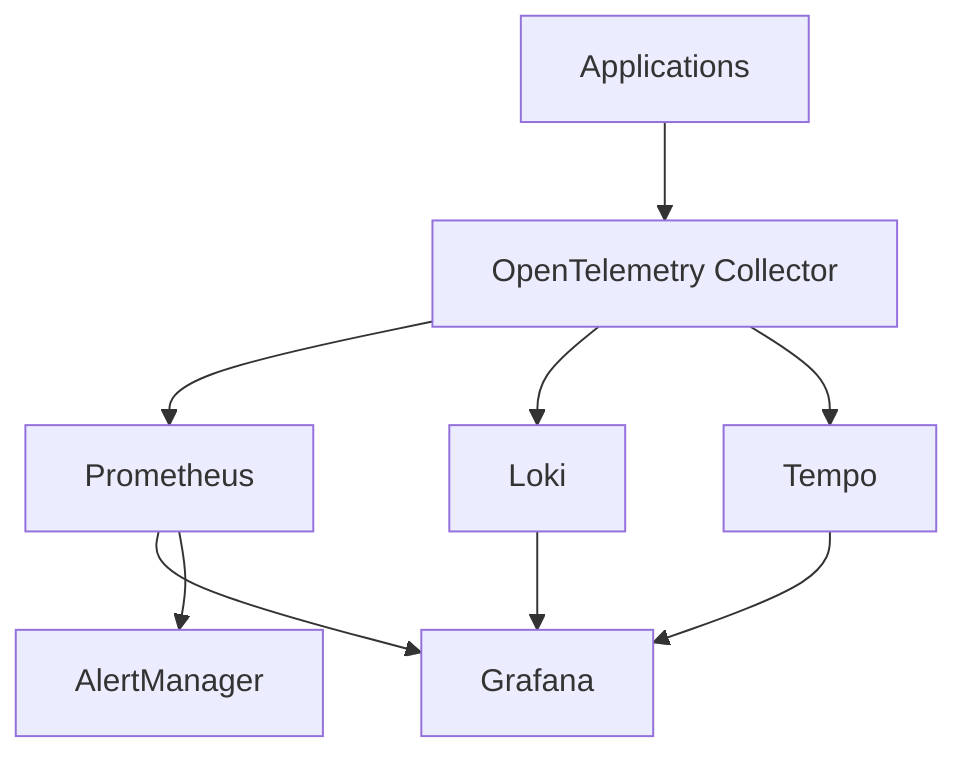

# Monitoring Infrastructure Stack

A comprehensive monitoring infrastructure setup using Prometheus, Grafana, Loki, Tempo, and OpenTelemetry for complete observability including metrics, logs, and traces.

## Architecture Overview



## Components

| Component | Version | Port(s) | Purpose |
|-----------|---------|---------|----------|
| Prometheus | latest | 9090 | Metrics collection and storage |
| Grafana | latest | 3000 | Visualization platform |
| Loki | main | 3100 | Log aggregation |
| Tempo | latest | 4317, 4318, 3200 | Distributed tracing |
| OpenTelemetry | latest | 8888, 8889, 4316, 4315 | Telemetry collection |
| AlertManager | latest | 9093 | Alert management |

## Installation

1. Clone the repository:
```bash
git clone https://github.com/sarim2000/monitoring-grafana-stack
cd monitoring
```

2. Start the stack:
```bash
docker-compose up -d
```

3. Verify deployment:
```bash
docker-compose ps
```

## Service Endpoints

| Service | URL | Authentication |
|---------|-----|----------------|
| Grafana | http://localhost:3000 | Anonymous Admin (Dev only) |
| Prometheus | http://localhost:9090 | None |
| Loki | http://localhost:3100 | None |
| Tempo | http://localhost:3200 | None |
| AlertManager | http://localhost:9093 | None |

## Configuration Files

### prometheus.yml
```yaml
scrape_interval: 15s
evaluation_interval: 15s
rule_files:
  - "/etc/prometheus/prometheus-rules.yml"
```

### alertmanager.yml
```yaml
route:
  group_by: ['alertname']
  group_wait: 30s
  group_interval: 5m
  repeat_interval: 12h
```

### Data Persistence

| Service | Volume | Purpose |
|---------|--------|----------|
| Prometheus | prometheus_data | Metric storage |

## Network Configuration

All services communicate through a dedicated bridge network named 'loki'.

## Security Considerations

### Development Environment
- Anonymous authentication enabled
- No TLS/SSL
- No access control

### Production Requirements
1. Configure authentication:
   ```yaml
   GF_AUTH_ANONYMOUS_ENABLED: false
   GF_AUTH_BASIC_ENABLED: true
   ```
2. Enable TLS
3. Implement proper access controls
4. Set up secure webhook URLs
5. Configure retention policies

## Monitoring Stack Health

### Key Metrics
- Prometheus target status
- Loki ingestion rate
- Tempo trace throughput
- Service memory usage
- Disk usage for persistent volumes

### Common Issues

1. Out of Memory
```bash
docker stats  # Monitor container memory usage
```

2. Storage Issues
```bash
docker system df  # Check docker volume usage
```

3. Network Connectivity
```bash
docker network inspect loki
```

## Scaling Considerations

### Vertical Scaling
- Increase container memory limits
- Expand volume storage

### Horizontal Scaling
- Deploy multiple collector instances
- Configure load balancing

## Development

### Adding New Targets

1. Update prometheus.yml:
```yaml
scrape_configs:
  - job_name: 'new-target'
    static_configs:
      - targets: ['hostname:port']
```

2. Reload Prometheus configuration:
```bash
curl -X POST http://localhost:9090/-/reload
```

### Custom Dashboards

Store custom dashboard JSON in:
```
./grafana/dashboards/
```

## Troubleshooting

### Logs
```bash
# View service logs
docker-compose logs -f [service]

# Check Prometheus targets
curl localhost:9090/api/v1/targets

# Verify Loki status
curl localhost:3100/ready
```

### Debug Mode
```bash
# Start with debug logging
docker-compose up -d --env-file debug.env
```

## Contributing

1. Fork the repository
2. Create feature branch
3. Submit pull request

## License

MIT License - See LICENSE file for details
